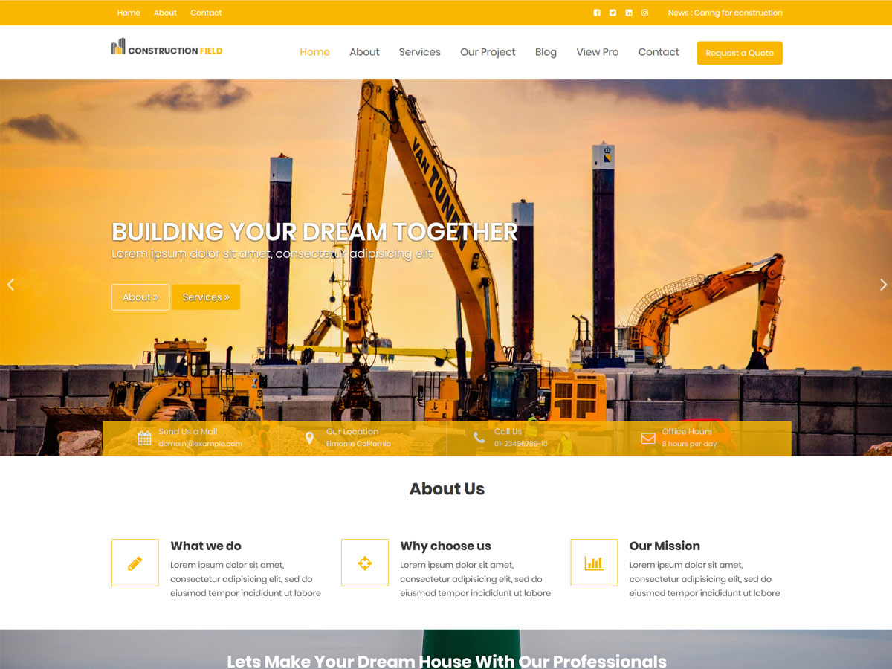

# Construction Field

**Contributors:** acmethemes  
**Requires at least:** 6.6  
**Tested up to:** 7.0  
**Requires PHP:** 7.4  
**Stable tag:** 4.0.0  
**License:** GPLv2 or later  
**License URI:** https://www.gnu.org/licenses/gpl-2.0.html  

> 

Construction Field is a WordPress theme purpose-built for construction companies, real estate agencies, and architecture firms. It gives you a commanding online presence with dedicated sections for showcasing your projects, services, testimonials, and team — everything you need to win more clients.

## Features

- **About section** — tell your company's story
- **Services showcase** — highlight your offerings with icons and descriptions
- **Project gallery** — display completed work with image galleries
- **Testimonials** — build trust with client reviews
- **FAQ/Accordion** — answer common questions without cluttering pages
- **Blog/News section** — share company updates and industry insights
- **Up to four-column layouts** — flexible grid for any content type
- **Full-width template** — impactful pages for landing and portfolios
- **Custom header & background** — brand your site your way
- **Footer widgets** — contact info, hours, quick links
- **Custom logo support** — upload your company logo
- **Translation ready** — .pot file included
- **RTL support** — right-to-left language compatible
- **SEO friendly & responsive** — rank well and work on any device

## Installation

1. Download the theme zip file.
2. In your WordPress admin, go to **Appearance → Themes**.
3. Click **Add New** → **Upload Theme**.
4. Select the zip file and click **Install Now**.
5. Click **Activate**.

## Frequently Asked Questions

### How do I customize the theme sections?

Go to **Appearance → Customize** — all sections (about, services, testimonials, gallery) are configurable from the customizer.

### How do I set up the front page?

Create a new page, go to **Settings → Reading**, and set it as the static front page.

## Credits

Construction Field is built on [Underscores](https://underscores.me/) and licensed under GPLv2 or later. It bundles the following third-party resources:

- [Google Fonts](https://fonts.google.com/) — Apache License 2.0
- [Font Awesome](https://fontawesome.com/) — MIT / SIL OFL 1.1
- [normalize.css](https://necolas.github.io/normalize.css/) — MIT
- [Bootstrap](http://getbootstrap.com/) — MIT
- [Isotope](https://isotope.metafizzy.co/) — GPLv3
- [Magnific Popup](https://github.com/dimsemenov/Magnific-Popup) — MIT
- [Theia Sticky Sidebar](https://github.com/WeCodePixels/theia-sticky-sidebar) — MIT
- [Breadcrumb Trail](https://github.com/justintadlock/breadcrumb-trail) — GPLv2+
- [TGM Plugin Activation](http://tgmpluginactivation.com/) — GPLv2+
- [html5shiv](https://github.com/afarkas/html5shiv) — MIT
- [Respond.js](https://github.com/scottjehl/Respond) — MIT
- [Waypoints](https://github.com/imakewebthings/waypoints/) — MIT
- [WOW](https://github.com/matthieua/WOW) — MIT
- [Slick](https://github.com/kenwheeler/slick/) — MIT
- [Easy Pie Chart](https://github.com/rendro/easy-pie-chart/) — MIT/GPL

---

[Demo](http://demo.acmethemes.com/construction-field) &middot; [Support](https://www.acmethemes.com/supports/) &middot; [Acme Themes](https://www.acmethemes.com)
